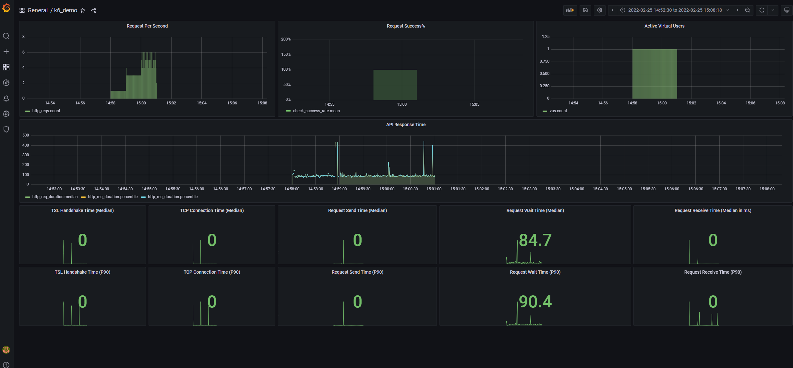

# k6_tests
Taste k6.io tests

Following are Simple Steps to run k6 tests on Windows, but linux or Mac OS platform will be similar:
- winget install k6
- write sample script with stepping scenarios
- install influxdb-1.8.10: https://portal.influxdata.com/downloads/
- PS C:\Program Files\InfluxData\influxdb> .\influxd -config .\influxdb.conf (you can modify the influxdb.conf based on your needs, like logging output)
- Install Grafana: https://grafana.com/grafana/download?edition=oss&platform=windows
- run the k6 test : k6 run --out influxdb=http://localhost:8086/myk6db k6_demo.js, this will create myk6db automatically
- access Grafana by: http://localhost:3000/login
- use admin/admin for username/pwd in grafana 

sample screenshot for k6 test grafana dashboard:

